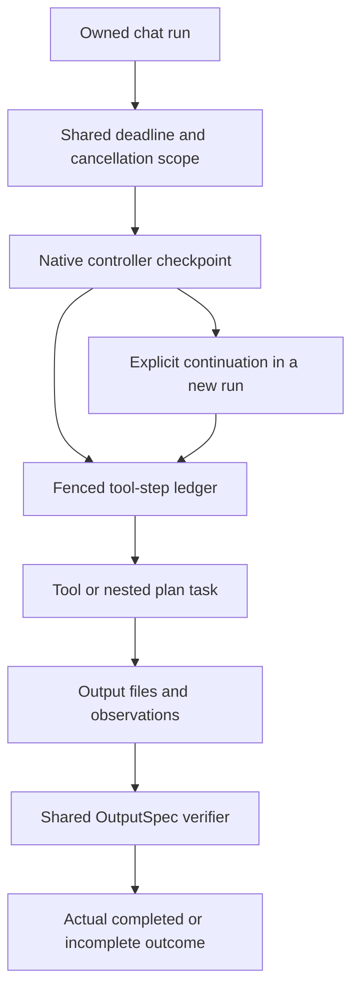

# Verified, bounded and resumable execution

This extends the execution-consistency changes on 2026-10-02. It addresses three
functional failures: different execution lanes disagreeing about completed
outputs, nested calls resetting their time allowances, and interrupted native
tool batches repeating work that already took effect.

## Output authority

`app/services/plans/output_spec.py` defines the version-1 serializable envelope.
It retains existing acceptance criteria and artifact contracts; precise file
requirements add distinct counts, formats, exact targets and in-place updates.
Plan verification, effective-state resolution and DeepThink use this envelope.
Explicit blocking failures remain failed even when files exist. Inferred text
and explicit nonblocking requirements stay advisory; manual acceptance retains
its existing authority.

Reliable manifest source-to-copy provenance gives automatic mirrors one count
slot. Independent files with identical bytes remain separate outputs. Relative
publisher fields use their explicit project/deliverable roots; conflicting
aliases and format conversions are not guessed into one origin.

In-place tasks freeze input hashes before either the internal executor or the
external delegate starts. An explicit continuation preserves that original
snapshot, while a fresh execution takes a new snapshot. Read-only input probes
do not manufacture produced outputs. Canonical accepted outputs can be reused
through the existing manifest with file identity checked. Composite parents with
their own authoritative output requirements must complete their own acceptance;
ordinary grouping parents continue to aggregate child states.

Precise PNG, PDF, JSON, XLSX and DOCX declarations receive basic readability
checks. File existence, format and content change do not prove scientific or
semantic correctness. Free-text content constraints are recorded as unchecked
when no corresponding structured check exists. Invalid supplied contracts fail
clearly instead of being truncated or weakened. Optional model extraction may
fall back to the existing conservative heuristic.

Existing v1 plan metadata is adapted without silently inventing precise counts.
File-count/path declarations apply when supplied as `required_outputs`, or when
a direct root request successfully extracts that specification. Ordinary plan
text is not automatically upgraded to an exact "three figures" contract. The
planning generator emitting complete OutputSpec declarations is a follow-up.

## One foreground deadline

`RunBudget` belongs to the chat run and propagates with its cancellation token,
lease claim and usage context across task handoffs, threads, Python-kernel RPC
and delegated tools. Each active stage uses the smaller of its existing timeout
and the remaining shared allowance. Pausing consumes wall-clock time. A deadline
is distinct from user cancellation and a retryable tool timeout.

`CHAT_RUN_BUDGET_SECONDS` defaults to 900 seconds; when unset, the existing
`DEEP_THINK_TIME_BUDGET_BREAK` value is respected. An explicit zero disables the
shared deadline while existing tool caps remain. `CHAT_RUN_CLOSE_RESERVE_SECONDS`
defaults to 10 seconds for cleanup and deterministic partial/error persistence.
The reserved window does not grant fresh tool or provider work after expiry.

Detached producers close their event sinks before bounded cancellation/join.
Closed inherited scopes reject late step writes, assistant saves and completion
events even if the SQL lease has not expired. Plan task commits also reject
cancelled/closed scopes and check the owning main-database claim while committing
the plan shard. Deadline/ownership failures bypass execution retries and repair.
Python threads cannot be forcibly
terminated; subprocess/kernel cancellation and write fencing contain their
effects where those mechanisms are available. Independently launched background
jobs keep their existing lifecycle.

## Durable steps and continuation

The main SQLite database gains `run_steps`, scoped `run_checkpoints` and bounded
checkpoint history. Payloads live in immutable JSON blobs under the configured
DB root's `run_blobs` directory. Tool-step identity includes controller namespace,
iteration, call position, provider call ID and the original parameter hash.
Plan task namespaces include both plan and task IDs.

Every write rechecks the owning run claim inside the SQL transaction. A verified
successful call can replay its stored observation without invoking the tool.
Its result blob and declared output hashes must still match. Uncertain mutations
require reconciliation; they are never automatically resubmitted. Read-only and
explicitly idempotent policies may restart uncertain work. The native controller
stops further writes when reconciliation is required and marks the final outcome
incomplete. This is not a universal exactly-once guarantee for external systems.

The controller checkpoints before a provider turn and before executing its tool
batch. Restoration preserves messages, observations, probe/execution counters,
schema disclosure, bound plan, output contracts and input snapshots. Root chats
and nested plan tasks have separate checkpoint keys. Superseded snapshots retain
only the latest three per scope; committed references and cross-process reader
locking protect current snapshots, continuation sources and step results.
There is no automatic sweep of unreferenced crash-window blobs or successful
step-result retention policy in this change.

Cached tool results restore artifact callbacks and both inner/outer plan binding,
including the session record and the current turn's plan-creation marker.
Local state restoration errors stop the controller before further writes.
Replayed Python
cells explicitly disclose that process variables were not restored. Remaining
unexecuted cells in that interrupted batch are deferred until the model can
rebuild inputs in a new cell.

`POST /chat/runs/{run_id}/resume` accepts a failed/cancelled run with a checkpoint
and creates a continuation in the same session. The source terminal history stays
unchanged. Repeating the default continuation request returns the same child run;
an explicitly new `client_message_id` requests another continuation attempt.
Each user-requested child receives a new foreground budget. This endpoint is an
execution API; this change does not add a browser resume button. Unsupported
controller/query changes block restoration rather than starting fresh silently.
Programmatic step reconciliation exists in the ledger; an operator-facing
reconciliation workflow remains separate work.

Task attempt markers distinguish untouched remaining tasks from entered tasks
whose checkpoint is missing. An untouched task can begin a new scope. A new
repair query requires finished existing scopes and confirmed prior mutations.
An entered legacy/delegated task with unknown effects cannot silently restart
under the continuation API. These checks prevent both replaying uncertain work
and incorrectly requiring a checkpoint for work the source never entered.

## Validation and rollout

Regression tests simulate worker loss immediately after a committed mutation,
changed or missing referenced outputs, duplicated continuation requests, plan
binding/schema replay, lost Python state, nested checkpoint isolation, bounded
snapshot retention, deadline propagation and late inherited writes. Existing
stream-event golden contracts remain covered; CI also includes kernel RPC tests.

Final local backend regression on this batch: 2976 passed, 8 environment/live
checks skipped, 1 external test deselected. New modules pass Ruff; the working
diff passes whitespace checks. No paid provider evaluation or production fault
injection was performed. The first-wave frontend source is unchanged in this
batch; its 155 tests, type check and production build previously passed.

Rollout requires the additive database initialization, the updated backend and
the first-wave frontend bundle together. Keep a database backup and drain active
runs before restarting production: old runs have no new resumable checkpoints.
Actual deployment state is recorded in `docs/HANDOFF.md` and `docs/LOCAL_INFRA.md`.
Resource-aware DAG parallelism, dependency-wide input-version invalidation,
per-lane memory consistency and human-visible reconciliation remain later work.
