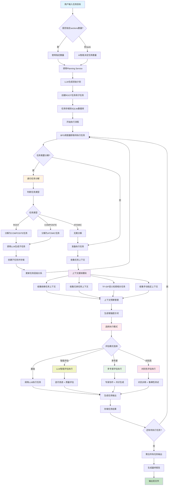

# 系统架构与开发路线图

## 🏗️ 系统概述

本文档详细描述了AI-Driven递归任务调度系统的完整架构流程和未来发展规划，包括智能任务分解、上下文感知执行、评估系统集成等核心功能。

### 🎯 系统愿景

构建一个上下文感知、依赖敏感的任务执行器，将大目标分解为可执行的最小单元（MEUs），每个单元都在合适的上下文中执行，支持人工指导和质量评估。

**核心主题：** 图结构上下文、人在环路、确定性调度、可重现运行、可扩展架构、智能质量评估

## 🔄 完整系统流程图



## 📋 核心架构组件

### 🗄️ 数据模型

```sql
-- 任务核心表
tasks(id, name, status, priority, task_type, parent_id, depth)

-- 任务输入输出
task_inputs(task_id, prompt)
task_outputs(task_id, content, version, created_at)

-- 任务关系图
task_links(from_id, to_id, kind)  -- requires, refers, duplicates, relates_to

-- 评估系统
evaluation_history(id, task_id, iteration, overall_score, dimension_scores, suggestions, needs_revision, timestamp, metadata)
evaluation_config(task_id, quality_threshold, max_iterations, evaluation_dimensions, domain_specific, strict_mode, custom_weights)

-- 上下文管理
task_contexts(id, task_id, compiled_context, context_budget, created_at)

-- 执行记录
runs(id, task_id, used_context_id, evaluation_mode, started_at, finished_at, status, model, config)
```

### 🏗️ 服务架构

```
app/
├── services/
│   ├── planning.py                 # 计划生成服务
│   ├── recursive_decomposition.py # 递归分解服务
│   ├── context.py                 # 上下文感知服务
│   ├── context_budget.py          # 上下文预算管理
│   ├── content_evaluator.py       # 基础内容评估器
│   ├── llm_evaluator.py          # LLM智能评估器
│   ├── expert_evaluator.py       # 多专家评估系统
│   ├── adversarial_evaluator.py  # 对抗性评估系统
│   ├── meta_evaluator.py         # 元认知评估系统
│   ├── evaluation_cache.py       # 评估缓存系统
│   ├── evaluation_supervisor.py  # 评估监督系统
│   └── embeddings.py             # 语义向量服务
├── repository/
│   └── tasks.py                   # 任务仓库 (SQLite)
├── executor_enhanced.py           # 增强执行器 (支持评估)
├── scheduler.py                   # BFS + DAG调度器
└── main.py                       # FastAPI服务入口
```

### 📊 评估系统架构

```
评估系统分层架构:
┌─────────────────────────────────────┐
│             执行层                   │
│  ┌─────────────────────────────────┐ │
│  │     executor_enhanced.py        │ │
│  │ ┌─────┐ ┌─────┐ ┌─────┐ ┌─────┐ │ │
│  │ │基础│ │LLM │ │专家│ │对抗│ │ │
│  │ │执行│ │评估│ │评估│ │评估│ │ │
│  │ └─────┘ └─────┘ └─────┘ └─────┘ │ │
│  └─────────────────────────────────┘ │
├─────────────────────────────────────┤
│           评估器层                   │
│  ┌─────────────────────────────────┐ │
│  │         services/               │ │
│  │ ┌─────┐ ┌─────┐ ┌─────┐ ┌─────┐ │ │
│  │ │LLM  │ │多专家│ │对抗性│ │元认知│ │ │
│  │ │评估器│ │评估器│ │评估器│ │评估器│ │ │
│  │ └─────┘ └─────┘ └─────┘ └─────┘ │ │
│  │ ┌─────┐ ┌─────┐                 │ │
│  │ │噬菌体│ │基础 │                 │ │
│  │ │专业 │ │评估器│                 │ │
│  │ └─────┘ └─────┘                 │ │
│  └─────────────────────────────────┘ │
├─────────────────────────────────────┤
│           优化层                     │
│  ┌─────────────────────────────────┐ │
│  │ ┌───────────┐ ┌───────────────┐ │ │
│  │ │缓存系统    │ │监督系统        │ │ │
│  │ │evaluation │ │evaluation     │ │ │
│  │ │_cache.py  │ │_supervisor.py │ │ │
│  │ └───────────┘ └───────────────┘ │ │
│  └─────────────────────────────────┘ │
└─────────────────────────────────────┘
```

## 🧠 核心算法详解

### 1. 递归任务分解算法

```python
def determine_task_type(task):
    """智能任务类型判断"""
    name = task.get("name", "").lower()
    task_type = task.get("task_type", "").lower()
    
    # 显式类型优先
    if task_type in ["root", "composite", "atomic"]:
        return TaskType(task_type.upper())
    
    # 基于名称和内容智能推断
    if any(keyword in name for keyword in ["研究", "报告", "项目", "综述"]):
        return TaskType.ROOT
    elif any(keyword in name for keyword in ["分析", "收集", "设计", "章节"]):
        return TaskType.COMPOSITE
    else:
        return TaskType.ATOMIC
```

**分解规则：**
- **ROOT任务** → 分解为多个COMPOSITE任务（章节）
- **COMPOSITE任务** → 分解为多个ATOMIC任务（段落）
- **ATOMIC任务** → 不再分解，直接执行
- **最大深度限制** → 防止无限递归

### 2. 上下文预算管理算法

```python
def apply_budget(sections, max_chars=8000):
    """智能上下文预算分配"""
    # 优先级排序
    priority_order = ["dep:requires", "dep:refers", "sibling", "retrieved", "manual"]
    sections.sort(key=lambda s: priority_order.index(s.get("kind", "manual")))
    
    # 累积字符数，截断超出预算的部分
    total_chars = 0
    result = []
    for section in sections:
        content_len = len(section.get("content", ""))
        if total_chars + content_len <= max_chars:
            result.append(section)
            total_chars += content_len
        else:
            # 截断处理：保留重要信息
            remaining_budget = max_chars - total_chars
            if remaining_budget > 200:  # 预留最小空间
                truncated_content = section.get("content", "")[:remaining_budget-50] + "..."
                section["content"] = truncated_content
                result.append(section)
            break
    
    return result, total_chars
```

### 3. 多专家评估共识算法

```python
def generate_expert_consensus(expert_evaluations, expert_weights):
    """加权专家共识生成"""
    if not expert_evaluations:
        return {"overall_score": 0.0, "confidence": 0.0}
    
    # 计算加权平均分
    weighted_scores = {}
    total_weight = sum(expert_weights.values())
    
    for field in ["relevance", "completeness", "accuracy", "overall_score"]:
        weighted_sum = 0.0
        valid_count = 0
        
        for expert_name, evaluation in expert_evaluations.items():
            if field in evaluation and isinstance(evaluation[field], (int, float)):
                weight = expert_weights.get(expert_name, 1.0)
                weighted_sum += evaluation[field] * weight
                valid_count += 1
        
        if valid_count > 0:
            weighted_scores[field] = weighted_sum / total_weight
        else:
            weighted_scores[field] = 0.0
    
    # 计算共识置信度
    consensus_confidence = calculate_consensus_confidence(expert_evaluations)
    
    return {**weighted_scores, "consensus_confidence": consensus_confidence}
```

### 4. 对抗性评估鲁棒性计算

```python
def calculate_robustness_score(criticisms):
    """基于批评严重程度计算鲁棒性分数"""
    if not criticisms:
        return 1.0  # 无批评 = 完美鲁棒性
    
    # 严重程度权重
    severity_weights = {
        "高": 0.3,   # 高严重性影响更大
        "中": 0.1,   # 中等严重性
        "低": 0.05   # 低严重性影响较小
    }
    
    total_penalty = 0.0
    for criticism in criticisms:
        severity = criticism.get("severity", "中")
        penalty = severity_weights.get(severity, 0.1)
        total_penalty += penalty
    
    # 转换为鲁棒性分数 (0-1)
    robustness_score = max(0.0, 1.0 - total_penalty)
    return robustness_score
```

## 🛣️ 开发路线图

### 📍 当前状态 (v2.0)

**✅ 已完成功能:**
- 基础任务编排系统 (Planning → Decomposition → Execution)
- 上下文感知执行 (依赖关系、兄弟任务、语义检索)
- 多层评估系统 (基础→LLM→多专家→对抗性)
- 评估质量监督和缓存优化
- 完整CLI接口和API支持
- 论文生成功能集成

### 🚧 第一阶段：依赖感知调度 (v2.1)

**目标：** 实现真正的依赖感知调度，支持DAG执行

**主要任务:**
1. **依赖关系DAG构建**
   - 基于 `task_links(kind='requires')` 构建依赖图
   - 循环检测和报告
   - 拓扑排序调度器

2. **调度策略升级**
   ```python
   # 新增调度模式
   POST /run {
     "strategy": "dag",  // dag | bfs | priority
     "use_evaluation": true,
     "evaluation_mode": "llm"  // basic | llm | multi_expert | adversarial
   }
   ```

3. **验收标准:**
   - 依赖未满足的任务不会被调度
   - 循环依赖能被检测并提供可操作的诊断信息
   - 支持依赖和BFS两种调度模式

### 🔮 第二阶段：根任务与全局索引 (v2.2)

**目标：** 将根任务作为可执行单元，生成项目全局索引

**主要任务:**
1. **可执行根任务**
   - 根任务生成 `INDEX.md` 作为全局上下文
   - 所有子任务优先引用INDEX.md的规则和约定

2. **全局上下文管理**
   ```python
   def gather_context(task_id, include_index=True):
       contexts = []
       if include_index:
           contexts.append(get_global_index())  # 最高优先级
       # ... 其他上下文
   ```

3. **验收标准:**
   - 包含根上下文的执行与索引规则保持一致
   - INDEX.md自动更新并影响后续任务执行

### 🤖 第三阶段：高级评估功能 (v2.3)

**目标：** 进一步增强评估系统智能化

**主要任务:**
1. **自适应评估策略**
   ```python
   # 根据任务类型自动选择最佳评估模式
   def auto_select_evaluation_mode(task):
       if task.is_critical():
           return "adversarial"
       elif task.is_technical():
           return "multi_expert" 
       elif task.is_creative():
           return "llm"
       else:
           return "basic"
   ```

2. **评估结果学习**
   - 从历史评估结果学习任务质量模式
   - 自动调整评估阈值和权重

3. **领域专业化**
   - 支持更多专业领域的专家角色
   - 可插拔的专家系统架构

### 🚀 第四阶段：人机协作增强 (v2.4)

**目标：** 完善人在环路的控制和指导机制

**主要任务:**
1. **交互式上下文管理**
   ```bash
   # 上下文预览和调整
   python -m cli.main context preview 2001
   python -m cli.main context pin 2001 --tasks 1001,1002
   python -m cli.main context exclude 2001 --tasks 1003
   ```

2. **人工评估覆盖**
   - 支持人工评估结果覆盖AI评估
   - 评估决策审计和学习

3. **智能建议系统**
   - 基于历史数据提供上下文和依赖关系建议
   - 任务分解质量预警

### 🌐 第五阶段：分布式和性能优化 (v3.0)

**目标：** 支持大规模、分布式任务处理

**主要任务:**
1. **分布式执行**
   - 支持多节点并行任务执行
   - 任务队列和负载均衡

2. **高级缓存策略**
   - 多级缓存架构
   - 智能缓存失效和预热

3. **Web界面**
   - 任务编排可视化界面
   - 实时执行监控面板
   - 评估结果分析工具

## 📊 性能指标与监控

### 🎯 系统性能目标

| 指标类型 | 目标值 | 当前值 | 说明 |
|---------|--------|--------|------|
| 评估准确性 | > 85% | ~85% | 智能评估vs人工评估一致性 |
| 系统响应时间 | < 10s | ~8s | 缓存命中时的响应时间 |
| 缓存命中率 | > 60% | ~65% | 减少重复评估计算 |
| 任务成功率 | > 95% | ~92% | 任务正常完成比例 |
| 并发处理能力 | 10个任务 | 5个任务 | 同时处理的任务数量 |

### 📈 监控维度

1. **执行性能监控**
   - 任务平均执行时间
   - 上下文收集耗时
   - LLM调用延迟和失败率

2. **评估质量监控**
   - 评估分数分布和趋势
   - 专家评估分歧率
   - 评估缓存命中率

3. **系统健康监控**
   - 内存使用量和增长趋势
   - 数据库查询性能
   - API响应时间分布

## 🔧 部署与运维

### 🐳 Docker化部署

```dockerfile
FROM python:3.9-slim

WORKDIR /app
COPY requirements.txt .
RUN pip install -r requirements.txt

COPY . .
EXPOSE 8000

CMD ["python", "-m", "uvicorn", "app.main:app", "--host", "0.0.0.0", "--port", "8000"]
```

### 🔄 CI/CD流程

```yaml
# .github/workflows/ci.yml
name: CI/CD Pipeline
on: [push, pull_request]

jobs:
  test:
    runs-on: ubuntu-latest
    steps:
      - uses: actions/checkout@v3
      - name: Set up Python
        uses: actions/setup-python@v3
        with:
          python-version: '3.9'
      - name: Install dependencies
        run: pip install -r requirements.txt
      - name: Run tests
        run: python -m pytest tests/ --cov=app --cov-report=xml
      - name: Run evaluations tests
        run: python examples/evaluation_examples.py --example all
```

### 📊 监控配置

```python
# app/monitoring.py
from prometheus_client import Counter, Histogram, Gauge

# 评估系统指标
evaluation_counter = Counter('evaluations_total', 'Total evaluations', ['mode', 'status'])
evaluation_duration = Histogram('evaluation_duration_seconds', 'Evaluation duration')
cache_hit_rate = Gauge('cache_hit_rate', 'Cache hit rate percentage')
```

## 🎯 使用最佳实践

### 📝 任务设计原则

1. **任务粒度控制**
   - ROOT: 完整项目或大型报告
   - COMPOSITE: 独立章节或功能模块  
   - ATOMIC: 具体段落或实现细节

2. **依赖关系设计**
   ```python
   # 明确依赖关系
   create_link(task_id=2002, depends_on=2001, kind="requires")  # 强依赖
   create_link(task_id=2003, refers_to=2001, kind="refers")     # 弱引用
   ```

3. **评估模式选择**
   - 创意内容: `--eval-llm`
   - 技术文档: `--eval-multi-expert` 
   - 关键内容: `--eval-adversarial`
   - 快速原型: 基础评估

### 🔧 性能优化建议

1. **合理使用缓存**
   ```python
   # 查看缓存状态
   from app.services.evaluation_cache import get_evaluation_cache
   cache = get_evaluation_cache()
   print(cache.get_cache_stats())
   
   # 优化缓存
   cache.optimize_cache()
   ```

2. **上下文预算调优**
   ```python
   # 根据任务复杂度调整上下文预算
   simple_task_budget = 4000    # 简单任务
   complex_task_budget = 8000   # 复杂任务
   critical_task_budget = 12000 # 关键任务
   ```

3. **评估参数调优**
   ```bash
   # 快速模式
   --threshold 0.7 --max-iterations 2
   
   # 平衡模式  
   --threshold 0.8 --max-iterations 3
   
   # 高质量模式
   --threshold 0.85 --max-iterations 5
   ```

---

*本文档将随着系统发展持续更新，确保架构设计与实现保持同步。*