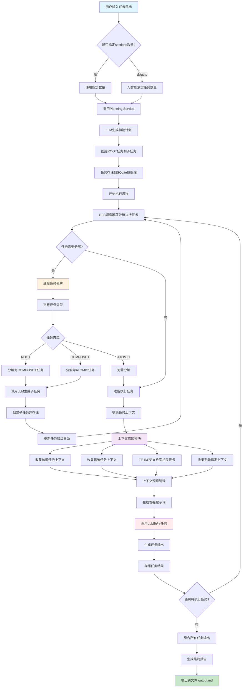
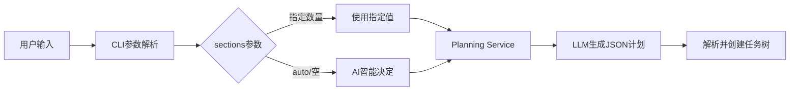
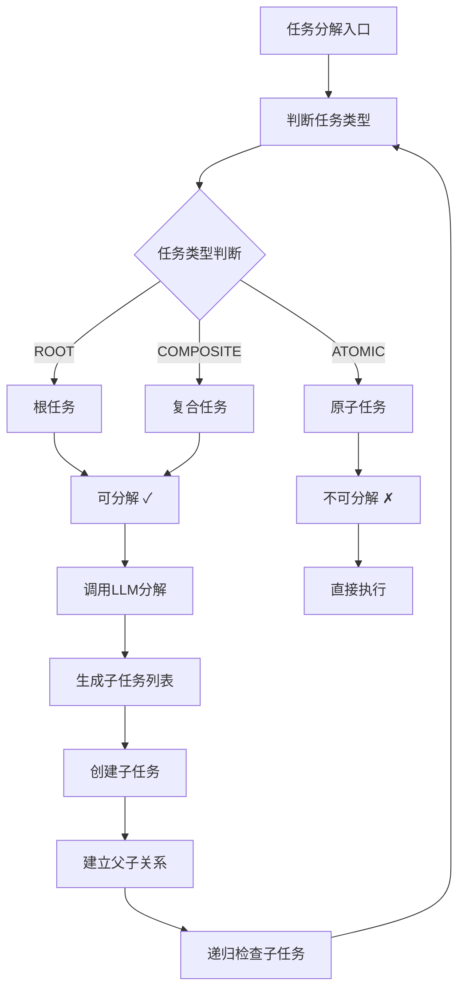
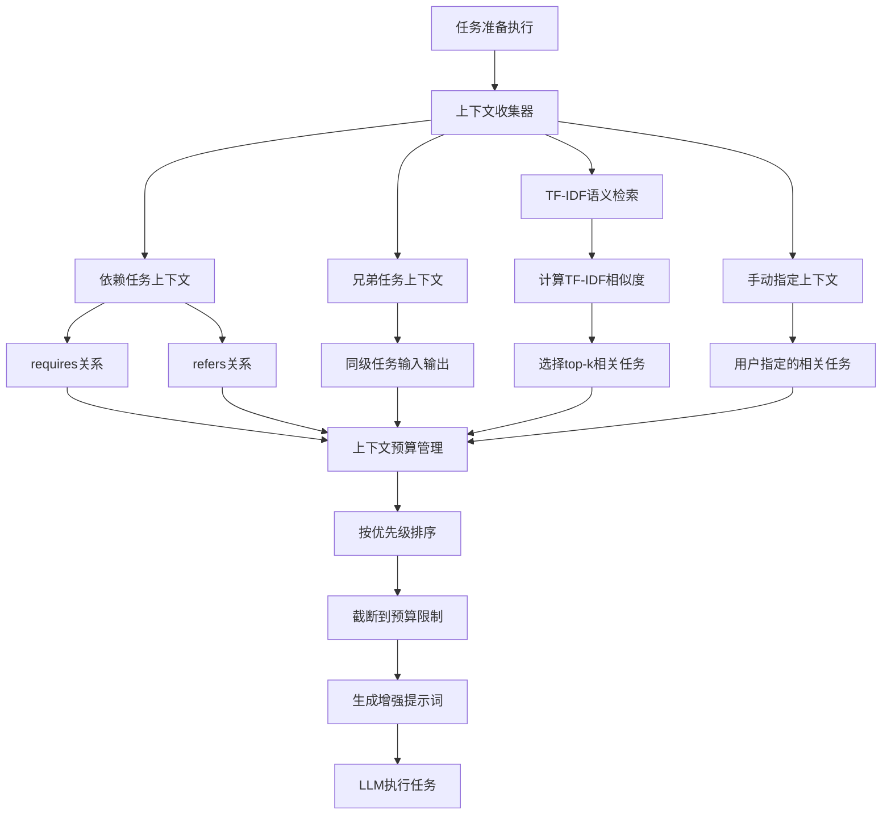
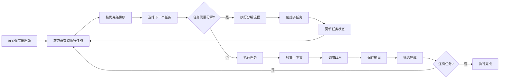

# AI-Driven Agent系统架构流程图

## 系统概述

本文档展示了AI-Driven递归任务调度系统从接收任务到生成最终输出的完整处理流程，包括智能任务分解、上下文感知执行等核心功能。

## 🔄 完整系统流程图



## 📋 ASCII流程图 (Markdown版本)

```
┌─────────────────────┐
│   用户输入任务目标     │
└──────────┬──────────┘
           │
           ▼
    ┌─────────────────┐
    │ sections数量？   │
    └─────┬─────┬─────┘
          │     │
     指定  │     │ auto/空
          ▼     ▼
   ┌─────────┐ ┌──────────────┐
   │使用指定值 │ │AI智能决定数量  │
   └────┬────┘ └──────┬───────┘
        │             │
        └─────┬───────┘
              ▼
    ┌─────────────────────┐
    │ 调用Planning Service │
    └──────────┬──────────┘
               │
               ▼
    ┌─────────────────────┐
    │ LLM生成初始计划       │
    └──────────┬──────────┘
               │
               ▼
    ┌─────────────────────┐
    │ 创建ROOT任务和子任务   │
    └──────────┬──────────┘
               │
               ▼
    ┌─────────────────────┐
    │ 任务存储到SQLite数据库 │
    └──────────┬──────────┘
               │
               ▼
    ┌─────────────────────┐
    │    开始执行流程       │
    └──────────┬──────────┘
               │
               ▼
    ┌─────────────────────┐
    │BFS调度器获取待执行任务  │
    └──────────┬──────────┘
               │
               ▼
         ┌─────────────┐
         │任务需要分解？  │
         └─────┬───┬───┘
               │   │
            是 │   │ 否
               ▼   ▼
    ┌─────────────┐ ┌─────────────┐
    │ 递归任务分解 │ │ 准备执行任务 │
    └─────┬───────┘ └─────┬───────┘
          │               │
          ▼               │
    ┌─────────────┐       │
    │ 判断任务类型 │        │
    └─────┬───────┘       │
          │               │
          ▼               │
    ┌─────────────┐       │
    │   任务类型   │       │
    │ ROOT/COMPOSITE/     │
    │    ATOMIC   │       │
    └─────┬───────┘       │
          │               │
          ▼               │
    ┌─────────────┐       │
    │调用LLM生成子任务│     │
    └─────┬───────┘       │
          │               │
          ▼               │
    ┌─────────────┐       │
    │创建子任务并存储│      │
    └─────┬───────┘       │
          │               │
          ▼               │
    ┌─────────────┐       │
    │更新任务层级关系│      │
    └─────┬───────┘       │
          │               │
          └───────────────┼─── 回到BFS调度器
                          │
                          ▼
                ┌─────────────────┐
                │   收集任务上下文  │
                └─────────┬───────┘
                          │
                          ▼
                ┌─────────────────┐
                │  上下文感知模块   │
                │                 │
                │ ┌─────────────┐ │
                │ │依赖任务上下文│ │
                │ └─────────────┘ │
                │ ┌─────────────┐ │
                │ │兄弟任务上下文│ │
                │ └─────────────┘ │
                │ ┌─────────────┐ │
                │ │TF-IDF语义检索│ │
                │ └─────────────┘ │
                │ ┌─────────────┐ │
                │ │手动指定上下文│ │
                │ └─────────────┘ │
                └─────────┬───────┘
                          │
                          ▼
                ┌─────────────────┐
                │  上下文预算管理   │
                └─────────┬───────┘
                          │
                          ▼
                ┌─────────────────┐
                │  生成增强提示词   │
                └─────────┬───────┘
                          │
                          ▼
                ┌─────────────────┐
                │  调用LLM执行任务  │
                └─────────┬───────┘
                          │
                          ▼
                ┌─────────────────┐
                │   生成任务输出    │
                └─────────┬───────┘
                          │
                          ▼
                ┌─────────────────┐
                │   存储任务结果    │
                └─────────┬───────┘
                          │
                          ▼
                   ┌─────────────┐
                   │还有待执行任务？│
                   └─────┬───┬───┘
                         │   │
                      是 │   │ 否
                         │   ▼
                         │ ┌─────────────────┐
                         │ │聚合所有任务输出  │
                         │ └─────────┬───────┘
                         │           │
                         │           ▼
                         │ ┌─────────────────┐
                         │ │  生成最终报告    │
                         │ └─────────┬───────┘
                         │           │
                         │           ▼
                         │ ┌─────────────────┐
                         │ │输出到文件output.md│
                         │ └─────────────────┘
                         │
                         └─── 回到BFS调度器
```

### 🔧 任务分解详细流程

```
                    ┌─────────────────┐
                    │   任务分解入口   │
                    └─────────┬───────┘
                              │
                              ▼
                    ┌─────────────────┐
                    │   判断任务类型   │
                    └─────────┬───────┘
                              │
                              ▼
                       ┌─────────────┐
                       │   任务类型   │
                       └─────┬───────┘
                             │
                ┌────────────┼────────────┐
                │            │            │
                ▼            ▼            ▼
        ┌─────────────┐ ┌─────────────┐ ┌─────────────┐
        │    ROOT     │ │  COMPOSITE  │ │   ATOMIC    │
        │   根任务    │ │   复合任务   │ │   原子任务   │
        └─────┬───────┘ └─────┬───────┘ └─────┬───────┘
              │               │               │
              ▼               ▼               ▼
        ┌─────────────┐ ┌─────────────┐ ┌─────────────┐
        │  可分解 ✓   │ │  可分解 ✓   │ │ 不可分解 ✗  │
        └─────┬───────┘ └─────┬───────┘ └─────┬───────┘
              │               │               │
              └───────┬───────┘               ▼
                      │             ┌─────────────┐
                      ▼             │   直接执行   │
            ┌─────────────────┐     └─────────────┘
            │  调用LLM分解    │
            └─────────┬───────┘
                      │
                      ▼
            ┌─────────────────┐
            │ 生成子任务列表   │
            └─────────┬───────┘
                      │
                      ▼
            ┌─────────────────┐
            │   创建子任务    │
            └─────────┬───────┘
                      │
                      ▼
            ┌─────────────────┐
            │  建立父子关系   │
            └─────────┬───────┘
                      │
                      ▼
            ┌─────────────────┐
            │ 递归检查子任务   │
            └─────────────────┘
```

### 🧠 上下文感知执行流程

```
        ┌─────────────────┐
        │  任务准备执行   │
        └─────────┬───────┘
                  │
                  ▼
        ┌─────────────────┐
        │  上下文收集器   │
        └─────────┬───────┘
                  │
      ┌───────────┼───────────┐
      │           │           │
      ▼           ▼           ▼
┌─────────┐ ┌─────────┐ ┌─────────────┐
│依赖任务 │ │兄弟任务 │ │TF-IDF语义   │
│上下文   │ │上下文   │ │检索相关任务  │
└────┬────┘ └────┬────┘ └─────┬───────┘
     │           │            │
     ▼           ▼            ▼
┌─────────┐ ┌─────────┐ ┌─────────────┐
│requires │ │sibling  │ │计算TF-IDF   │
│refers   │ │tasks    │ │相似度       │
└────┬────┘ └────┬────┘ └─────┬───────┘
     │           │            │
     └─────┬─────┴─────┬──────┘
           │           │
           ▼           ▼
     ┌─────────────────────┐
     │   上下文预算管理     │
     │                    │
     │ ┌─────────────────┐ │
     │ │ 按优先级排序     │ │
     │ └─────────────────┘ │
     │ ┌─────────────────┐ │
     │ │ 截断到预算限制   │ │
     │ └─────────────────┘ │
     └─────────┬───────────┘
               │
               ▼
     ┌─────────────────────┐
     │   生成增强提示词     │
     └─────────┬───────────┘
               │
               ▼
     ┌─────────────────────┐
     │   LLM执行任务       │
     └─────────────────────┘
```

## 📋 详细流程说明

### 1. 任务接收与计划生成阶段



**关键组件:**
- `agent_cli.py` - CLI入口点
- `app/services/planning.py` - 计划生成服务
- `app/repository/tasks.py` - 任务存储

### 2. 递归任务分解机制



**分解规则:**
- **ROOT任务** → 分解为多个COMPOSITE任务
- **COMPOSITE任务** → 分解为多个ATOMIC任务  
- **ATOMIC任务** → 不再分解，直接执行
- **最大深度限制** → 防止无限递归

### 3. 上下文感知执行机制



**上下文类型:**
- `dep:requires` - 强依赖任务
- `dep:refers` - 引用任务
- `sibling` - 兄弟任务
- `retrieved` - 语义相关任务
- `manual` - 手动指定任务

### 4. BFS调度执行流程



## 🏗️ 系统架构组件

### 核心服务模块

```
app/services/
├── planning.py              # 计划生成服务
├── recursive_decomposition.py  # 递归分解服务
├── context.py               # 上下文感知服务
├── context_budget.py        # 上下文预算管理
└── index_root.py           # 根任务索引
```

### 数据存储层

```
app/repository/
├── tasks.py                # 任务仓库(SQLite)
└── __init__.py
```

### 执行引擎

```
app/
├── executor.py             # 任务执行器
├── scheduler.py            # BFS调度器
└── main.py                # FastAPI服务
```

## 🔧 关键算法

### 1. 任务类型判断算法

```python
def determine_task_type(task):
    name = task.get("name", "").lower()
    task_type = task.get("task_type", "").lower()
    
    # 显式类型优先
    if task_type in ["root", "composite", "atomic"]:
        return TaskType(task_type.upper())
    
    # 基于名称推断
    if any(keyword in name for keyword in ["研究", "报告", "项目"]):
        return TaskType.ROOT
    elif any(keyword in name for keyword in ["分析", "收集", "设计"]):
        return TaskType.COMPOSITE
    else:
        return TaskType.ATOMIC
```

### 2. TF-IDF语义检索算法

```python
def tfidf_retrieve_similar_tasks(query_tokens, candidates, k=3):
    # 计算TF-IDF向量
    vectorizer = TfidfVectorizer()
    corpus = [query] + [task_content for task_content in candidates]
    tfidf_matrix = vectorizer.fit_transform(corpus)
    
    # 计算余弦相似度
    similarities = cosine_similarity(tfidf_matrix[0:1], tfidf_matrix[1:])
    
    # 返回top-k相似任务
    top_indices = similarities.argsort()[0][-k:][::-1]
    return [candidates[i] for i in top_indices]
```

### 3. 上下文预算管理

```python
def apply_budget(sections, max_chars=8000):
    # 按优先级排序
    priority_order = ["dep:requires", "dep:refers", "sibling", "retrieved", "manual"]
    sections.sort(key=lambda s: priority_order.index(s.get("kind", "manual")))
    
    # 累积字符数，截断超出预算的部分
    total_chars = 0
    result = []
    for section in sections:
        content_len = len(section.get("content", ""))
        if total_chars + content_len <= max_chars:
            result.append(section)
            total_chars += content_len
        else:
            break
    
    return result
```

## 📊 性能特性

- **并发执行**: BFS调度器支持任务并发执行
- **内存优化**: 上下文预算管理防止内存溢出
- **容错机制**: 任务执行失败时的重试和降级策略
- **可扩展性**: 模块化设计支持新功能扩展

## 🎯 使用示例

```bash
# 1. 生成计划(AI自动决定任务数)
python agent_cli.py plan "蛋白质结合位点研究" --sections auto

# 2. 执行计划(启用上下文感知)
python agent_cli.py execute "蛋白质结合位点研究" --use-context --save-snapshot

# 3. 手动分解特定任务
curl -X POST "http://localhost:8000/tasks/105/decompose" \
  -H "Content-Type: application/json" \
  -d '{"max_subtasks": 5}'

# 4. 获取任务上下文
curl "http://localhost:8000/tasks/105/context?include_deps=true&tfidf_k=3"
```

---

*本文档展示了AI-Driven Agent系统的完整架构流程，涵盖了从任务接收到最终输出的所有关键环节。*
