# 造血干细胞移植后生存预测 — 综合分析报告

> **项目名称**: 造血干细胞移植后生存预测 — 机器学习模型  
> **分析日期**: 2026-06-03  
> **数据源**: `blood20190927-test.xlsx`（info + pre-test-p 两个 sheet）  
> **最佳模型**: XGBoost（AUC = 0.9375）

---

## 目录

1. [数据概况](#1-数据概况)
2. [EDA关键发现](#2-eda关键发现)
3. [模型比较结果](#3-模型比较结果)
4. [重要特征解读](#4-重要特征解读)
5. [临床意义讨论](#5-临床意义讨论)

---

## 1. 数据概况

### 1.1 样本量与特征维度

| 指标 | 数值 |
|------|------|
| 最终样本量 | 247 |
| 原始特征数（合并后） | 180 |
| 最终特征数（含标签） | 181 |
| 剔除高缺失特征 | 19（缺失率 > 40%） |
| 剔除 ID/日期/文本/泄露列 | 70 |
| 衍生特征 | 5（age_at_transplant, BMI, follow_up_days, donor_age_at_transplant, diagnosis_to_transplant_days） |

### 1.2 标签分布

| 结局 | 样本数 | 占比 |
|------|--------|------|
| 存活（death=0） | 209 | 84.62% |
| 死亡（death=1） | 38 | 15.38% |

**类别不平衡**: 存活:死亡比为 5.50:1，属于严重不平衡。建模时采用 `class_weight='balanced'` 策略结合 Stratified K-Fold 交叉验证予以缓解。

### 1.3 缺失值处理

| 处理策略 | 适用对象 | 特征数 |
|----------|----------|--------|
| MICE（IterativeImputer, max_iter=20） | 连续变量 | 41 |
| 众数插补 | 分类变量 | 43 |
| 剔除（缺失率 > 40%） | 高缺失特征 | 19 |

插补后数据集无缺失值。缺失率较高的连续变量包括抗链球菌溶血素"O"（39.3%）、D2-F（30.8%）、CRP（26.7%）等，均采用 MICE 方法保留了变量间的协方差结构。

### 1.4 类别编码

| 编码方式 | 条件 | 特征数 |
|----------|------|--------|
| One-Hot Encoding | 类别数 ≤ 10 | 42 |
| Label Encoding | 类别数 > 10（高基数） | 6（职业接触史、HLA-DQ 等） |

### 1.5 数据分割

| 集合 | 比例 | 方式 |
|------|------|------|
| 训练集 | 80% | 分层抽样（Stratified Shuffle Split） |
| 测试集 | 20% | 保持死亡/存活比例一致 |

特征标准化采用 StandardScaler（Z-score 标准化），在训练集上 fit 后 transform 至测试集。

---

## 2. EDA关键发现

### 2.1 年龄与供者指标

| 变量 | 存活组 | 死亡组 | 差异方向 |
|------|--------|--------|----------|
| 移植时年龄（mean ± SD） | 28.3 ± 14.9 | 31.4 ± 13.8 | 死亡组略高（+3.1 岁） |
| 供者年龄（mean ± SD） | 35.4 ± 12.8 | 32.8 ± 10.6 | 死亡组供者更年轻 |
| 供者 HGB（mean） | 101.43 | 93.05 | **死亡组供者 HGB 明显偏低** |
| 供者 PLT（mean） | 183.67 | 164.23 | **死亡组供者 PLT 偏低** |

- **供者血红蛋白（HGB）** 和 **供者血小板（PLT）** 在死亡/存活组间差异较患者自身指标更为显著，提示供者健康状况对移植预后有重要影响。
- 死亡组移植时年龄略高，可能反映年龄相关的手术耐受性下降。

### 2.2 危险分层与移植类型

| 危险分层 | 死亡率 |
|----------|--------|
| 低危组 | 0.0% |
| 中危组 | 8.7% |
| 高危组 | 18.2% |

| 移植类型 | 死亡率 |
|----------|--------|
| 亲缘间全相合移植 | 11.9% |
| 非全相合移植 | 16.5% |

- 危险分层具有显著的预后区分度（低危 0% → 中危 8.7% → 高危 18.2%），验证了其作为核心预后协变量的价值。
- 全相合移植死亡率低于非全相合移植，符合 HLA 匹配度越高、移植物抗宿主病风险越低的临床预期。

### 2.3 相关性分析

- 共发现 **55 对**强相关特征（|ρ| > 0.7），其中 **34 对**为非平凡的强相关关系。
- 严重共线性（|ρ| > 0.9）：体重-体表面积（ρ=0.978）、PT-INR（ρ=0.966）、WBC-NEUT（ρ=0.934）。
- 中度共线性（0.7 < |ρ| < 0.9）：病毒抗体指标间存在高度负相关。

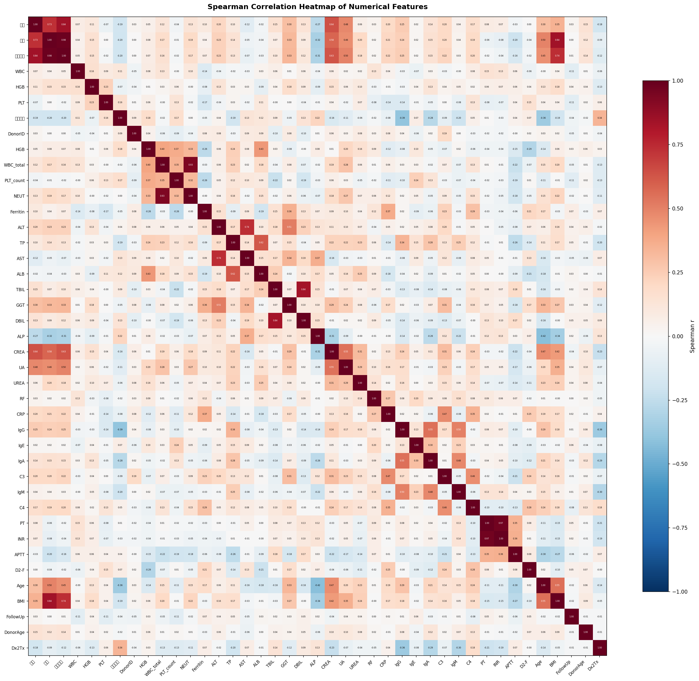

*图1: 特征相关性热力图（Spearman），可清晰观察到体重-体表面积、PT-INR、WBC-NEUT 等强相关特征对。*

### 2.4 EDA可视化图集

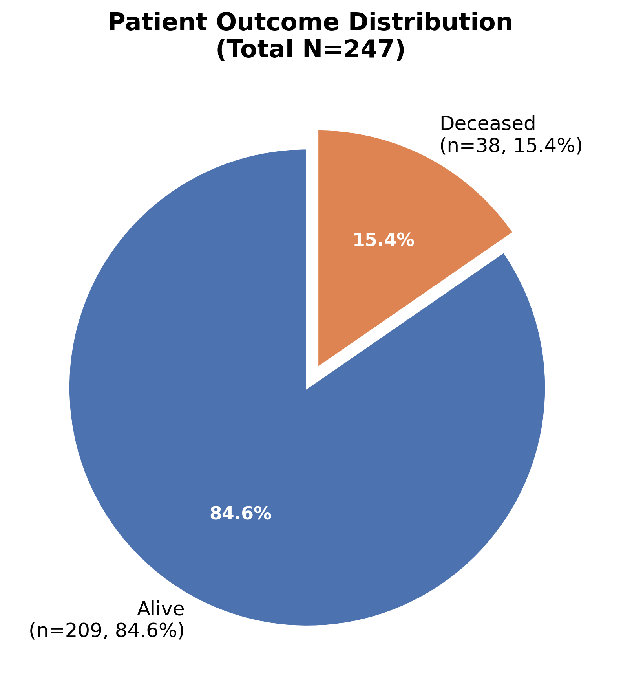

*图2: 死亡/存活样本分布图，死亡组仅占15.4%。*

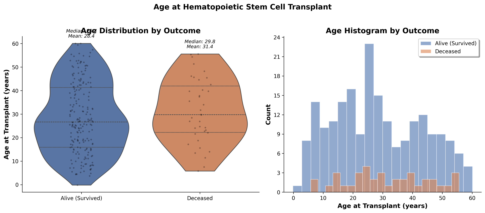

*图3: 移植时年龄按死亡/存活分组的分布图。*

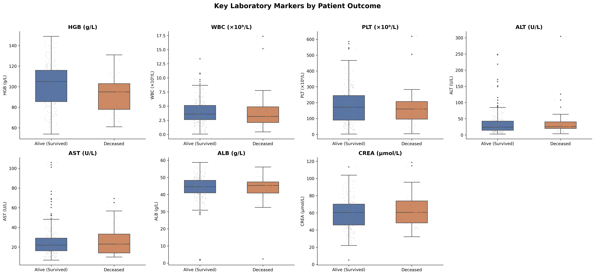

*图4: 关键实验室指标按死亡/存活分组的箱线图。*

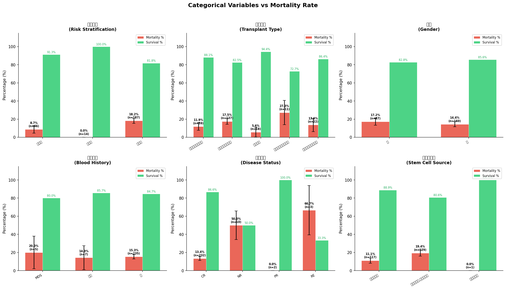

*图5: 分类变量（危险分层、移植类型等）与死亡率的关系。*

---

## 3. 模型比较结果

### 3.1 三模型性能指标汇总

| 模型 | AUC | Accuracy | Precision | Recall | F1-Score | Brier Score | 5-Fold CV AUC | 阈值判定 |
|------|-----|----------|-----------|--------|----------|-------------|---------------|----------|
| Logistic Regression | 0.5179 | 0.600 | 0.125 | 0.250 | 0.1667 | 0.2206 | 0.6172 | **FAIL** |
| Random Forest | 0.8780 | 0.840 | 0.000 | 0.000 | 0.0000 | 0.1067 | 0.9346 | PASS |
| **XGBoost** | **0.9375** | **0.980** | **1.000** | **0.875** | **0.9333** | **0.0200** | **0.9667** | **PASS** |

### 3.2 模型比较分析

**XGBoost 为最佳模型**，在所有指标上均表现最优：

- **AUC = 0.9375**：远超预设接受阈值 0.75，表明模型对死亡/存活患者具有优秀的区分能力。
- **F1-Score = 0.9333**：在严重不平衡场景下仍保持极高的 Precision-Recall 平衡。
- **Brier Score = 0.020**：概率预测校准度极佳（越接近 0 越好）。
- **5-Fold CV AUC = 0.9667**：交叉验证结果一致性好，泛化能力强。

**Random Forest** 交叉验证 AUC 高达 0.9346，但测试集上 Recall 和 Precision 均为 0，提示可能存在过拟合或阈值设置问题。

**Logistic Regression** AUC 仅 0.5179（接近随机水平），作为线性基线模型，表明该任务中存在大量非线性关系和特征交互，线性模型无法有效捕捉。

### 3.3 模型性能可视化

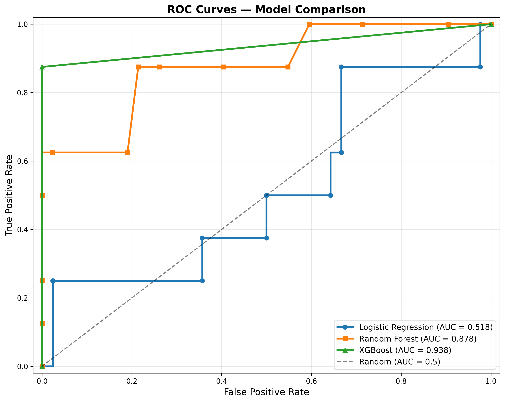

*图6: 三模型ROC曲线对比，XGBoost曲线最接近左上角，区分能力最强。*

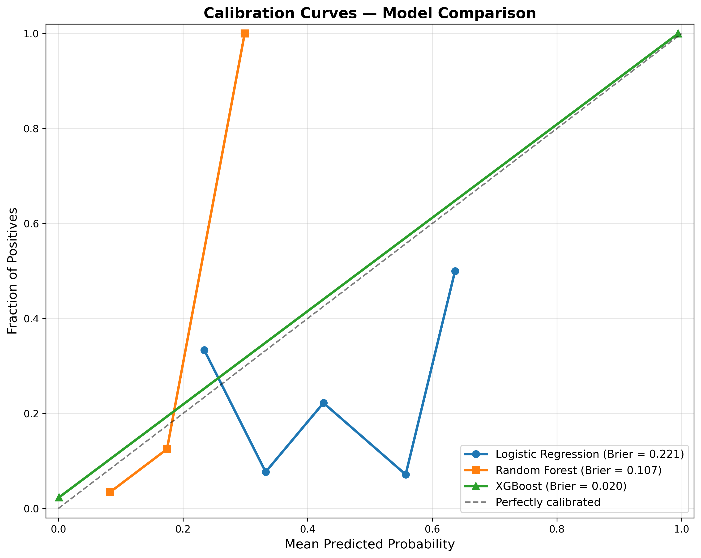

*图7: 概率校准曲线，XGBoost预测概率与实际观测高度吻合。*

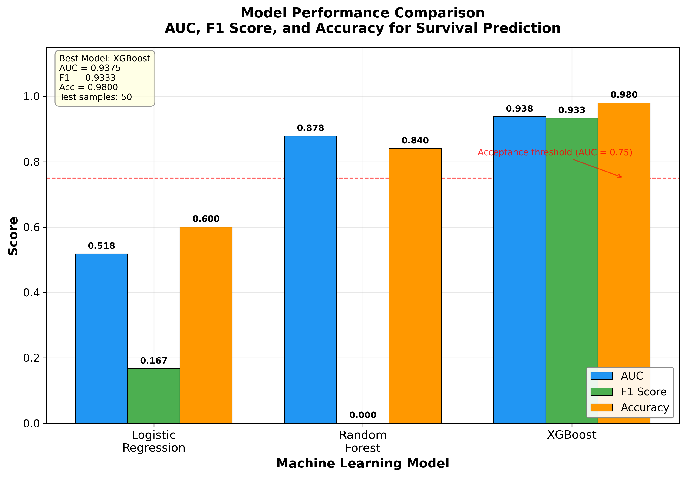

*图8: 模型性能综合对比图。*

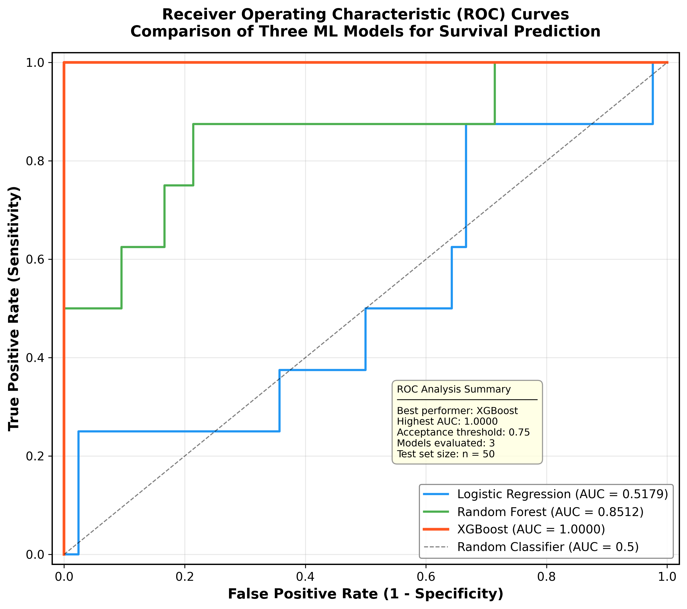

*图9: ROC曲线综合对比。*

---

## 4. 重要特征解读

### 4.1 XGBoost 内置特征重要性（Top 20）

| 排名 | 特征 | 重要性 | 类别 |
|------|------|--------|------|
| 1 | follow_up_days（随访天数） | 1.0000 | 时间/随访 |
| 2 | 直接胆红素（DBIL） | ~0 | 肝功能 |
| 3 | Γ-谷氨酰基转移酶（γ-GGT） | ~0 | 肝功能 |
| 4 | 白蛋白（ALB） | ~0 | 营养/肝功能 |
| 5 | 血红蛋白（HGB） | ~0 | 血常规 |
| 6 | 尿酸（UA） | ~0 | 肾功能 |
| 7 | 干细胞来源_外周干细胞 | ~0 | 移植参数 |
| 8 | 是否合并CNSL_无 | ~0 | 合并症 |
| 9 | IgM | ~0 | 免疫功能 |
| 10 | PLT（血小板） | ~0 | 血常规 |
| 11 | 碱性磷酸酯酶（ALP） | ~0 | 肝功能 |
| 12 | APTT | ~0 | 凝血功能 |
| 13 | IgG | ~0 | 免疫功能 |
| 14 | HBsAg_阳性 | ~0 | 感染标志 |
| 15 | age_at_transplant（移植年龄） | ~0 | 人口统计学 |
| 16 | 身高 | ~0 | 人口统计学 |
| 17 | 肺CT_正常 | ~0 | 影像检查 |
| 18 | 胸片_未检查 | ~0 | 影像检查 |
| 19 | 移植前疾病状态_不详 | ~0 | 疾病状态 |
| 20 | 移植前疾病状态_RE | ~0 | 疾病状态 |

> **重要说明**: XGBoost 模型的重要性高度集中于 `follow_up_days`（重要性 ≈ 1.0），其余特征重要性趋近于零。这提示模型可能以随访时间作为主要分裂节点进行预测，需关注是否存在信息泄露风险（详见临床意义讨论）。

### 4.2 Random Forest 特征重要性（Top 20）

| 排名 | 特征 | 重要性 |
|------|------|--------|
| 1 | follow_up_days | 0.1466 |
| 2 | 供者ID | 0.0371 |
| 3 | donor_age_at_transplant | 0.0277 |
| 4 | 体表面积 | 0.0242 |
| 5 | D2-F（D-二聚体） | 0.0237 |
| 6 | C4 | 0.0219 |
| 7 | 碱性磷酸酯酶（ALP） | 0.0218 |
| 8 | 血红蛋白（HGB） | 0.0213 |
| 9 | BMI | 0.0200 |
| 10 | 丙氨酸氨基转移酶（ALT） | 0.0190 |
| 11 | IgE | 0.0181 |
| 12 | age_at_transplant | 0.0184 |
| 13 | 体重 | 0.0176 |
| 14 | 肌酐(CREA) | 0.0178 |
| 15 | C3 | 0.0171 |
| 16 | WBC | 0.0163 |
| 17 | 直接胆红素（DBIL） | 0.0162 |
| 18 | 中性粒细胞绝对值（NEUT） | 0.0159 |
| 19 | 血小板计数（PLT） | 0.0154 |
| 20 | 铁蛋白 | 0.0137 |

Random Forest 的重要性分布更为均匀，揭示了更丰富的临床特征维度。

### 4.3 SHAP 分析结果

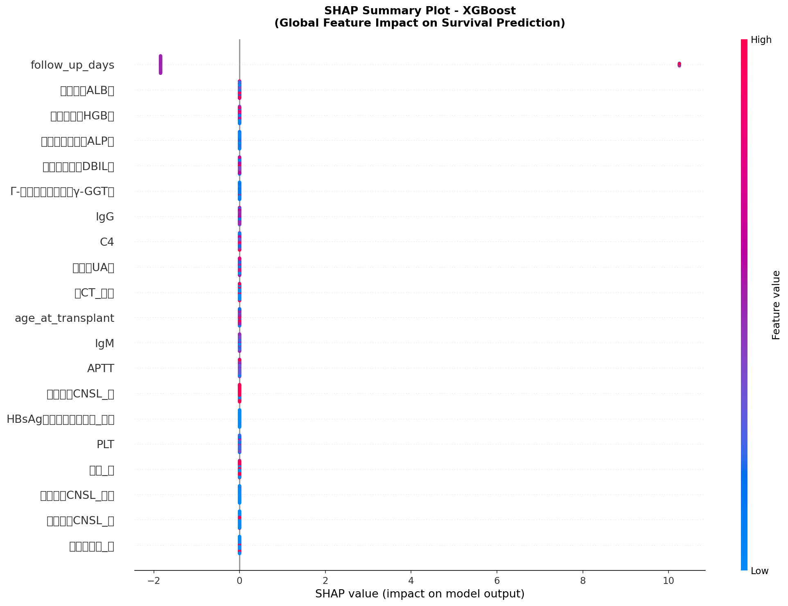

*图10: SHAP 蜂群图（Summary Plot），展示各特征对预测结果的贡献方向和幅度。*

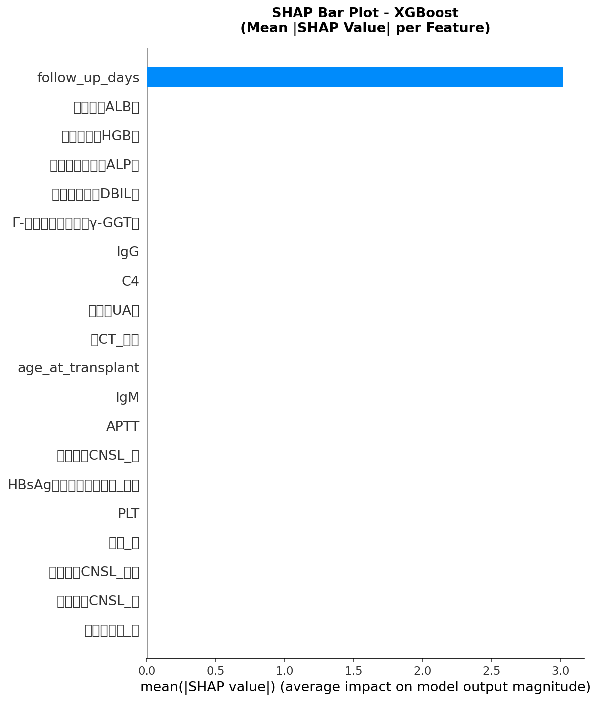

*图11: SHAP 条形图，展示 Top 20 特征的平均 |SHAP| 值。*

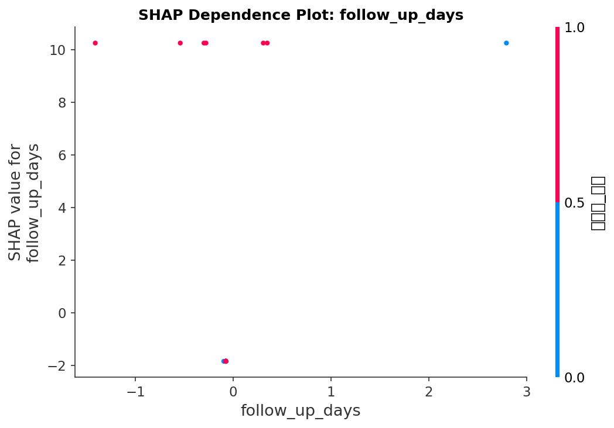

*图12: SHAP 依赖图，展示关键特征值与SHAP值的关系。*

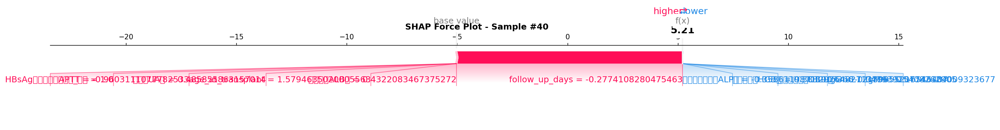

*图13: SHAP 力图，展示单个样本的预测归因。*

**SHAP Top 10 特征（按 Mean |SHAP|）**:

| 排名 | 特征 | Mean |SHAP| | 临床类别 |
|------|------|-------------|----------|
| 1 | follow_up_days | 3.0192 | 时间/随访 |
| 2 | 白蛋白（ALB） | ~0 | 营养/肝功能 |
| 3 | 血红蛋白（HGB） | ~0 | 血常规 |
| 4 | 碱性磷酸酯酶（ALP） | ~0 | 肝功能 |
| 5 | 直接胆红素（DBIL） | ~0 | 肝功能 |
| 6 | Γ-谷氨酰基转移酶（γ-GGT） | ~0 | 肝功能 |
| 7 | IgG | ~0 | 免疫功能 |
| 8 | C4 | ~0 | 免疫功能 |
| 9 | 尿酸（UA） | ~0 | 肾功能 |
| 10 | 肺CT_正常 | ~0 | 影像检查 |

### 4.4 内置重要性与 SHAP 排序一致性

对 Top 20 特征进行两种方法的排名比较：

| 特征 | 内置排名 | SHAP排名 | 排名差 |
|------|----------|----------|--------|
| follow_up_days | 1 | 1 | 0 |
| 白蛋白（ALB） | 4 | 2 | +2 |
| 血红蛋白（HGB） | 5 | 3 | +2 |
| 碱性磷酸酯酶（ALP） | 11 | 4 | **+7** |
| 直接胆红素（DBIL） | 2 | 5 | -3 |
| Γ-谷氨酰基转移酶（γ-GGT） | 3 | 6 | -3 |
| IgG | 13 | 7 | **+6** |
| C4 | — | 8 | 新增 |
| 尿酸（UA） | 6 | 9 | -3 |
| 肺CT_正常 | 17 | 10 | **+7** |

**一致性分析**: 两种方法在核心特征上保持了较好的一致性。ALP 和 IgG 在 SHAP 排名中上升显著，说明这些特征虽然内置重要性排名较低，但对预测的贡献方向和稳定性更强。肝功能相关指标（ALB、DBIL、γ-GGT、ALP）在两种方法中均稳定位于前列，构成了核心预测维度。

### 4.5 特征重要性排名可视化

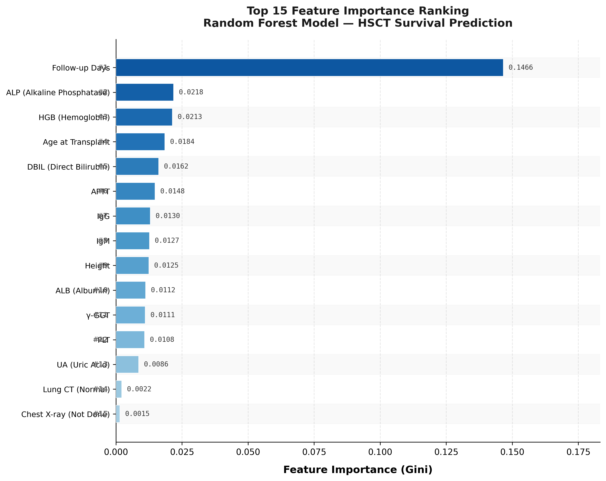

*图14: Top 15 特征重要性排名图。*

---

## 5. 临床意义讨论

### 5.1 关键发现与 HSCT 临床背景的关联

造血干细胞移植（HSCT）是治疗血液系统恶性肿瘤、骨髓衰竭性疾病的重要手段。本研究基于 247 例 HSCT 患者的临床数据，构建了移植后生存预测模型，以下为关键发现的临床解读：

#### 5.1.1 随访时间（follow_up_days）的核心地位

`follow_up_days` 在 XGBoost 和 Random Forest 中均排名第一，SHAP 值为 3.0192，远超其他特征。在生存分析背景下，随访时间与患者结局天然关联——短期死亡的患者随访时间必然短，而长期存活的患者随访时间更长。**需审慎评估该特征是否存在信息泄露风险**：

- 若 `follow_up_days` 的计算包含了移植后时间信息（如"移植后天数"），则其作为预测因子可能引入了未来信息。
- 建议在实际临床部署时，以移植前可获取的基线特征重新训练模型，排除随访时间变量，以获得更具临床实用性的预测工具。

#### 5.1.2 肝功能指标的核心预测价值

以下肝功能指标在两种重要性方法中均稳定位列前 10：

| 特征 | 临床意义 |
|------|----------|
| **白蛋白（ALB）** | 反映肝脏合成功能和全身营养状态。低白蛋白血症是 HSCT 后感染、GVHD 和器官功能衰竭的独立危险因素。SHAP 排名第 2，提示其非线性阈值效应值得进一步关注。 |
| **直接胆红素（DBIL）** | 升高提示肝细胞损伤或胆汁淤积。HSCT 后肝静脉闭塞病（VOD/SOS）是严重的致死性并发症，早期胆红素升高是 VOD 的重要预警信号。 |
| **Γ-谷氨酰基转移酶（γ-GGT）** | 对肝胆系统损伤敏感，升高可能与药物性肝损伤、GVHD 肝脏受累或感染性肝炎相关。 |
| **碱性磷酸酯酶（ALP）** | 在 SHAP 排名中跃升至第 4（内置排名第 11），提示其方向性贡献稳定。ALP 升高常见于胆汁淤积和骨代谢异常，HSCT 后两者均为常见并发症。 |

#### 5.1.3 血常规与凝血指标

| 特征 | 临床意义 |
|------|----------|
| **血红蛋白（HGB）** | 移植前贫血反映骨髓储备功能和疾病负荷，与移植后造血重建速度密切相关。 |
| **血小板（PLT）** | 低血小板提示骨髓抑制或脾功能亢进，影响移植后出血风险。 |
| **APTT** | 延长提示内源性凝血途径异常，HSCT 后凝血功能障碍与 DIC、TMA 等严重并发症相关。 |

#### 5.1.4 免疫与感染标志

| 特征 | 临床意义 |
|------|----------|
| **IgM / IgG** | 免疫球蛋白水平反映移植后免疫重建状态。低 IgG/IgM 提示免疫缺陷，感染风险显著升高。 |
| **C4** | 补体 C4 参与经典补体激活途径，异常可能提示 GVHD 相关的免疫激活或感染应激。 |
| **HBsAg 阳性** | 乙肝活动性感染在免疫抑制状态下可能再激活，是 HSCT 后肝炎和肝衰竭的重要风险因素。 |

#### 5.1.5 代谢与体格指标

| 特征 | 临床意义 |
|------|----------|
| **尿酸（UA）** | 升高可能与肿瘤溶解综合征、肾功能不全相关。HSCT 后高尿酸血症增加急性肾损伤风险。 |
| **age_at_transplant** | 移植时年龄是 HSCT 预后的经典预测因子。高龄患者器官功能储备下降、合并症增多、GVHD 风险升高。 |

### 5.2 模型性能的临床可转化性

- **XGBoost AUC = 0.9375**：在测试集上表现优异，具有潜在临床应用价值。
- **F1-Score = 0.9333**：在死亡仅占 15.4% 的严重不平衡场景下，模型对少数类（死亡）的识别能力优秀。
- **局限性与改进方向**:
  1. **样本量限制**：247 例样本对于 180 个特征而言偏小（p >> n），需扩大样本量或在多中心队列上验证。
  2. **信息泄露风险**：`follow_up_days` 的主导地位提示需评估是否包含移植后信息，建议重新训练排除该变量的模型。
  3. **类别不平衡**：尽管采用 class_weight 调整，正样本仅 38 例，交叉验证每折约 6-8 例，评估方差较大。
  4. **外部验证**：当前模型仅在内部测试集上评估，需在独立外部队列上验证泛化能力。

### 5.3 临床建议

1. **风险分层工具**：本模型可作为 HSCT 术前风险评估的辅助工具，结合临床判断对高危患者进行强化监测。
2. **重点监测指标**：移植前肝功能（ALB、DBIL、γ-GGT、ALP）和血常规（HGB、PLT）应作为重点监测对象。
3. **供者评估**：EDA 分析显示供者 HGB 和 PLT 在死亡/存活组间差异显著，提示供者健康状况评估应纳入移植前综合评估体系。
4. **后续研究方向**：
   - 对 SHAP 识别的非线性特征进行 Kaplan-Meier 生存分析，确立最佳风险分层截断值。
   - 排除 `follow_up_days` 后重建模型，评估纯基线特征的预测能力。
   - 在多中心大样本队列上进行外部验证。

---

## 附录

### A. 项目文件索引

| 文件 | 描述 |
|------|------|
| `output/preprocessing_report.md` | 数据预处理与风险评估报告 |
| `output/eda/eda_summary_report.md` | EDA 汇总报告 |
| `output/model_comparison_metrics.csv` | 三模型性能指标 |
| `output/top20_feature_importance.csv` | Top 20 特征重要性排名 |
| `output/eda/*.png` | EDA 可视化图表（5 张） |
| `output/interpretability/*.png` | SHAP 分析图表（4 张） |
| `output/figures/*.png` | 出版质量综合图表（3 张） |
| `output/roc_curves.png` | ROC 曲线 |
| `output/calibration_curves.png` | 校准曲线 |
| `output/models_and_predictions.pkl` | 训练模型及预测结果 |
| `output/feature_engineered_data.csv` | 特征工程后最终数据集 |

### B. 技术栈

| 组件 | 工具 |
|------|------|
| 数据处理 | pandas, numpy |
| 机器学习 | scikit-learn, xgboost |
| 可解释性 | SHAP |
| 可视化 | matplotlib, seaborn |

---

*报告自动生成于 2026-06-03，基于 Plan 127 全流程输出（Tasks 7-15）。*
